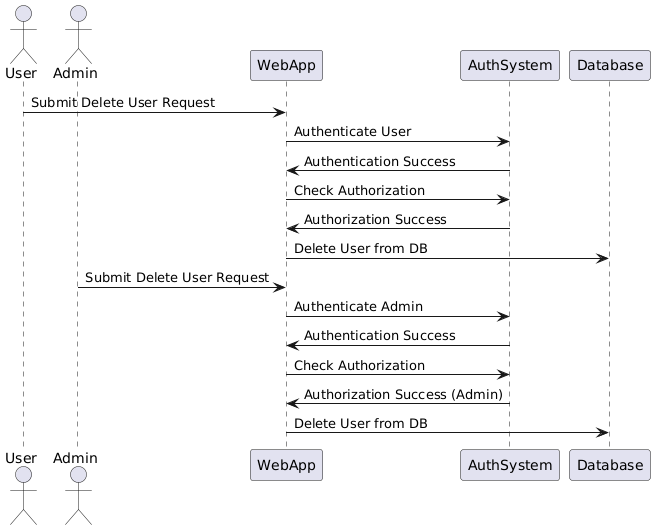

Here’s a Markdown explanation of the code provided in `deleteUser.js`:

---

# Delete User Functionality

This guide walks you through the implementation of a basic "Delete User" functionality in a Node.js application. The implementation includes back-end logic, routing, and front-end user interaction, all compiled into a single file called `deleteUser.js`.

## File: `deleteUser.js`

The file contains the following components:

### 1. **Backend Controller Function: `delete_user_by_username`**

This function handles the logic for deleting a user from the database by their username. It receives the username via a `POST` request and interacts with the database using Sequelize.

- **Functionality**:
  - Verifies if the `username` is provided in the request body.
  - Attempts to delete the user with the given username from the database.
  - Returns a success or error message based on whether the user was found and deleted.

```javascript
const delete_user_by_username = async (req, res) => {
  const { username } = req.body;

  if (!username) {
    return res.status(400).json({ message: "Username is required" });
  }

  try {
    const deletedUser = await UserModel.destroy({
      where: {
        username: username
      }
    });

    if (deletedUser) {
      return res.status(200).json({ message: "User deleted successfully" });
    } else {
      return res.status(404).json({ message: "User not found" });
    }
  } catch (error) {
    console.error("Error deleting user:", error);
    return res.status(500).json({ message: "An error occurred while deleting the user" });
  }
};
```

### 2. **Backend Route: `/delete/user`**

This route is defined using Express.js and connects the deletion logic to a specific endpoint (`/delete/user`). It ensures that only authenticated users can trigger the delete functionality.

- **Route Configuration**:
  - Uses `authentication` middleware to ensure the user is logged in.
  - Uses `authorisation` middleware to enforce role-based access (e.g., only certain roles can delete users).
  - Calls the `delete_user_by_username` controller function upon receiving a `POST` request.

```javascript
router.post(
  "/delete/user",
  authentication, // Middleware for authentication
  authorisation({ isAdmin: false }), // Authorization logic, you can adjust this if only admins can delete users
  (req, res) => delete_user_by_username(req, res)
);
```

### 3. **Frontend Form for Deleting a User**

The front-end part consists of an HTML form where the user can input the username of the account they wish to delete. The form is dynamically added to the web page.

```javascript
const deleteUserForm = `
  <form id="delete-user-form">
    <label for="other-username">Enter Username to Delete:</label>
    <input type="text" id="other-username" name="other-username" required>
    <button type="submit">Delete User</button>
  </form>
`;

document.body.innerHTML += deleteUserForm; // Append the form to the body
```

### 4. **Frontend JavaScript for Handling Form Submission**

This JavaScript snippet listens for the form submission event, prevents the default form submission behavior, and sends an asynchronous `POST` request to the back-end endpoint to delete the user.

- **Form Submission Logic**:
  - Retrieves the username entered by the user.
  - Sends a `POST` request to the `/delete/user` endpoint with the username in the request body.
  - Displays a success or error message based on the response.

```javascript
document.getElementById("delete-user-form").addEventListener("submit", async (event) => {
  event.preventDefault();

  const username = document.getElementById("other-username").value;

  try {
    const response = await fetch(`http://localhost:4001/auth/delete/user`, {
      method: "POST",
      headers: {
        "Content-Type": "application/json",
      },
      body: JSON.stringify({
        username
      })
    });

    const data = await response.json();

    if (response.ok) {
      alert("User deleted successfully!");
    } else {
      alert(data.message || "An error occurred.");
    }
  } catch (error) {
    console.error("Error deleting user:", error);
    alert("Error deleting user");
  }
});
```

### 5. **Export the Router**

The `router` is exported so it can be used in the main application file, typically `app.js` or `index.js`.

```javascript
module.exports = router;
```

## Summary

- **Backend Logic**: Implements a user deletion function using Sequelize ORM.
- **Route Setup**: Secures the delete route with authentication and authorization middleware.
- **Frontend Interaction**: Simple form allows users to input a username and trigger the delete action.


### Markdown Documentation for Delete User Functionality

---

## Delete User Functionality

### Purpose:
In this challenge, we are tasked with adding a **delete user** functionality to a web application. The goal is to allow a user to delete another user based on their username, but only after proper **authentication** and **authorization** checks are performed.

### Backend Implementation

#### 1. **authController.js** - Adding the delete function
We create a new function called `delete_user_by_username` inside the `authController.js` file to handle the user deletion logic. This function uses Sequelize ORM to remove a user from the database by their username.

```javascript
// authController.js

const delete_user_by_username = async (req, res) => {
    try {
        const { username } = req.body;
        const deleted = await UserModel.destroy({
            where: { username }
        });

        if (deleted) {
            return res.status(200).send(`User ${username} deleted successfully`);
        } else {
            return res.status(404).send('User not found');
        }
    } catch (error) {
        return res.status(500).send('Server error');
    }
};
```

#### 2. **Routes** - Adding the delete route
We include a POST route to trigger the `delete_user_by_username` function after proper authentication and authorization.

```javascript
// authHandling.js

router.post(
    "/delete/user",
    authentication, // Ensure the user is authenticated
    authorisation({ isAdmin: false }), // Authorization logic can be updated as needed
    (req, res) => authController.delete_user_by_username(req, res)
);
```

### Frontend Implementation

We create a basic form that allows users to input the username of the user they wish to delete. This form sends a POST request to the backend, triggering the deletion process.

#### 3. **HTML Form**
```html
<!-- HTML form to delete user -->
<form id="delete-user-form">
    <label for="other-username">Enter the username to delete:</label>
    <input type="text" id="other-username" name="other-username" required>
    <button type="submit">Delete User</button>
</form>
```

#### 4. **JavaScript Handler**
We use the Fetch API in JavaScript to handle the form submission, sending a POST request with the username to delete.

```javascript
// JavaScript handler for delete user functionality
document.getElementById("delete-user-form").addEventListener("submit", async (event) => {
    event.preventDefault();
    const username = document.getElementById("other-username").value;
    
    const response = await fetch(`http://localhost:4001/auth/delete/user`, {
        method: "POST",
        headers: {
            "Content-Type": "application/json"
        },
        body: JSON.stringify({ username })
    });
    
    const result = await response.text();
    alert(result); // Show the result to the user
});
```

### Authentication vs Authorization: Explanation

Authentication and authorization are two different processes often confused with one another. Let’s define and explain their differences.

#### **Authentication**: 
This process verifies the identity of the user. It confirms "who" the user is through credentials like username/password or tokens (JWT). In this delete functionality, we authenticate the user before they can proceed to delete any user.

#### **Authorization**:
Authorization controls "what" the user is allowed to do. After authentication, the system checks if the user has the rights or permissions to delete another user. 

In our case, even though a user is authenticated, they may not have the necessary authorization to delete users unless they meet certain criteria (e.g., admin privileges).

### Pros and Cons of "Delete after Authentication" Approach

**Pros:**
- Simplicity: A basic authentication check ensures that only logged-in users can delete another user.
- Security: Prevents unauthenticated users from accessing the delete functionality.

**Cons:**
- Insufficient Protection: If only authentication is checked, any authenticated user may delete another user without proper authorization.
- Potential Exploits: Malicious users with a valid account could delete other users without restrictions.

**Recommendation:**
A better approach would be to check both **authentication** and **authorization**. This ensures that only users with the proper permissions (like admin rights) can delete other users, making the system more secure.

### Diagram

The following diagram illustrates the interaction between **authentication** and **authorization** during the delete user process.


